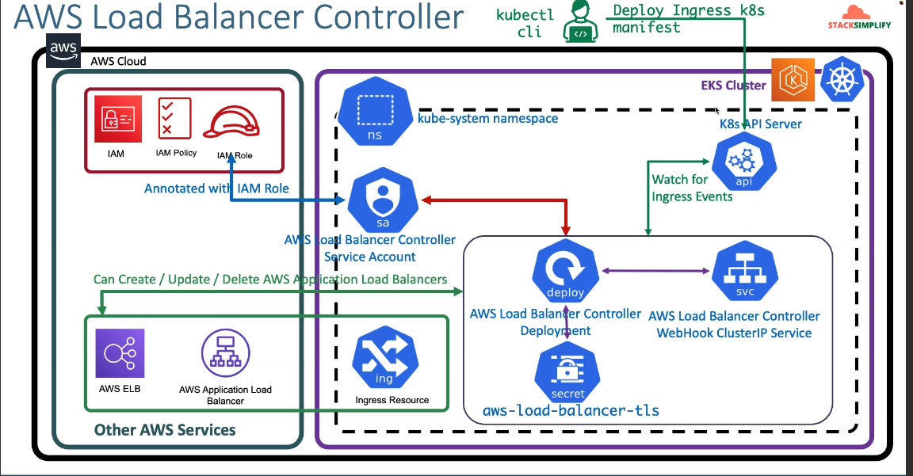

# Application LoadBalaner


### AWS Load Balancer Controller



## Steps:

- Create IAM Policy and make a note of Policy ARN
- Create IAM Role and k8s Service Account and bound them together
- Install AWS Load Balancer Controller using HELM3 CLI
- Understand IngressClass Concept and create a default Ingress Class

### 1. Create IAM Policy
```bash
https://raw.githubusercontent.com/kubernetes-sigs/aws-load-balancer-controller/main/docs/install/iam_policy.json
```

```bash
aws iam create-policy \
    --policy-name AWSLoadBalancerControllerIAMPolicy \
    --policy-document file://iam_policy.json 
```
```bash
prashanthg@prashanthg:~/automation/Aws_EKS/LoadBalancers/Application-LB$ aws iam create-policy \
    --policy-name AWSLoadBalancerControllerIAMPolicy \
    --policy-document file://iam_policy.json  
{
    "Policy": {
        "PolicyName": "AWSLoadBalancerControllerIAMPolicy",
        "PolicyId": "ANPA4MTWGX34KKO6MEQZH",
        "Arn": "arn:aws:iam::851725172472:policy/AWSLoadBalancerControllerIAMPolicy",
        "Path": "/",
        "DefaultVersionId": "v1",
        "AttachmentCount": 0,
        "PermissionsBoundaryUsageCount": 0,
        "IsAttachable": true,
        "CreateDate": "2024-10-24T20:48:16+00:00",
        "UpdateDate": "2024-10-24T20:48:16+00:00"
    }
}
```
### 2. Create IAM Role using eksctl
```bash
eksctl create iamserviceaccount \
  --cluster=my_cluster \
  --namespace=kube-system \
  --name=aws-load-balancer-controller \ #Note:  K8S Service Account Name that need to be bound to newly created IAM Role
  --attach-policy-arn=arn:aws:iam::851725172472:policy/AWSLoadBalancerControllerIAMPolic \
  --override-existing-serviceaccounts \
  --approve
  ```
  ```bash
kubectl get sa -n kube-system
kubectl get sa aws-load-balancer-controller -n kube-system
kubectl describe sa aws-load-balancer-controller -n kube-system
```

### 3. Install the AWS Load Balancer Controller using Helm
#### Install AWS Load Balancer Controller
- Note-1: If you're deploying the controller to Amazon EC2 nodes that have restricted access to the Amazon EC2 instance metadata service (IMDS), or if you're deploying to Fargate, then add the following flags to the command that you run:
```bash
--set region=region-code
--set vpcId=vpc-xxxxxxxx
```
- Note-2: If you're deploying to any Region other than us-west-2, then add the following flag to the command that you run, replacing account and region-code with the values for your region listed in Amazon EKS add-on container image addresses.
```bash
--set image.repository=account.dkr.ecr.region-code.amazonaws.com/amazon/aws-load-balancer-controller
```

 - **EndPoints**
 ```url 
 https://docs.aws.amazon.com/eks/latest/userguide/add-ons-images.html
 ```

```bash
# Add the eks-charts repository.
helm repo add eks https://aws.github.io/eks-charts

# Update your local repo to make sure that you have the most recent charts.
helm repo update

# Install the AWS Load Balancer Controller.
helm install aws-load-balancer-controller eks/aws-load-balancer-controller \
  -n kube-system \
  --set clusterName=<cluster-name> \
  --set serviceAccount.create=false \
  --set serviceAccount.name=aws-load-balancer-controller \
  --set region=<region-code> \
  --set vpcId=<vpc-xxxxxxxx> \
  --set image.repository=<account>.dkr.ecr.<region-code>.amazonaws.com/amazon/aws-load-balancer-controller

```

### 4. Verify that the controller is installed and Webhook Service created
```bash
kubectl -n kube-system get deployment 
kubectl -n kube-system get deployment aws-load-balancer-controller
kubectl -n kube-system describe deployment aws-load-balancer-controller
```

### 5. Verify AWS Load Balancer Controller Logs
```bash
kubectl get pods -n kube-system
kubectl -n kube-system logs -f <POD-NAME> 
```

### 6. Verify TLS Certs for AWS Load Balancer Controller - Internals
```bash
# List aws-load-balancer-tls secret 
kubectl -n kube-system get secret aws-load-balancer-tls -o yaml

# Verify the ca.crt and tls.crt in below websites
https://www.base64decode.org/
https://www.sslchecker.com/certdecoder

# Make a note of Common Name and SAN from above 
Common Name: aws-load-balancer-controller
SAN: aws-load-balancer-webhook-service.kube-system, aws-load-balancer-webhook-service.kube-system.svc

# List Pods in YAML format
kubectl -n kube-system get pods
kubectl -n kube-system get pod <AWS-Load-Balancer-Controller-POD-NAME> -o yaml
kubectl -n kube-system get pod aws-load-balancer-controller-65b4f64d6c-h2vh4 -o yaml
Observation:
1. Verify how the secret is mounted in AWS Load Balancer Controller Pod
CHECK-2: Verify Volume Mounts
    volumeMounts:
    - mountPath: /tmp/k8s-webhook-server/serving-certs
      name: cert
      readOnly: true
CHECK-3: Verify Volumes
  volumes:
  - name: cert
    secret:
      defaultMode: 420
      secretName: aws-load-balancer-tls

```